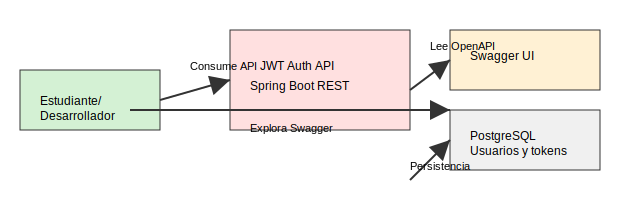
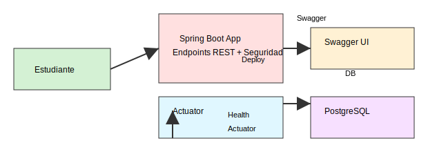
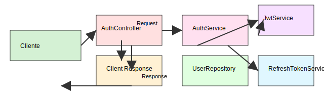
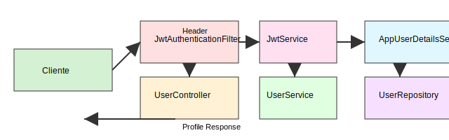

# Arquitectura C4

## Nivel 1: Contexto

## Nivel 2: Contenedores

## Nivel 3: Componentes

El contenedor de Spring Boot aglutina los controladores, servicios y repositorios descritos más abajo; puedes consultar `docs/technical/layered-flow.md` para ver sus relaciones detalladas.

## Nivel Dinamico: Flujo De Login

## Nivel Dinamico: Flujo De Endpoint Protegido

## Observaciones

- El sistema tiene un solo contenedor de aplicacion y una base de datos.
- No hay colas, cache distribuida ni microservicios.
- La mayor parte de la complejidad esta en autenticacion, seguridad y rotacion de refresh tokens.
